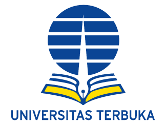

<!-- Logo UT -->

> Menjadi perguruan tinggi terbuka dan jarak jauh (PTTJJ) berkualitas dunia

[Visi & Misi](/visi-misi.md)
[Areditasi BAN-PT](/akreditasi.md)
[Biaya Pendidikan](/biaya-pendidikan.md)
[Katalog](/katalog.md)
[Registrasi Online](https://sia.ut.ac.id/)

<!-- background color -->

